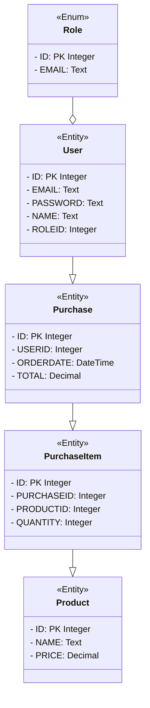
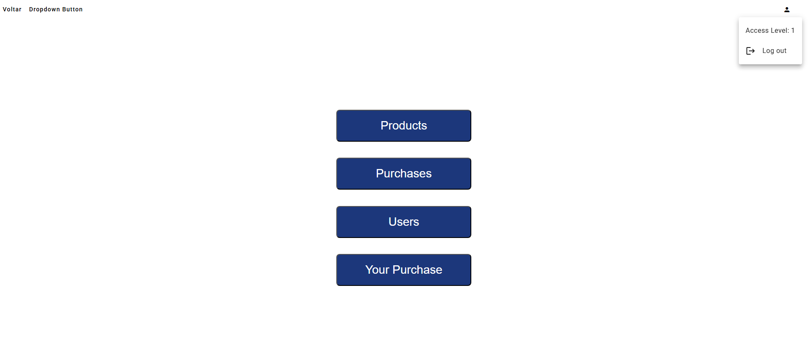
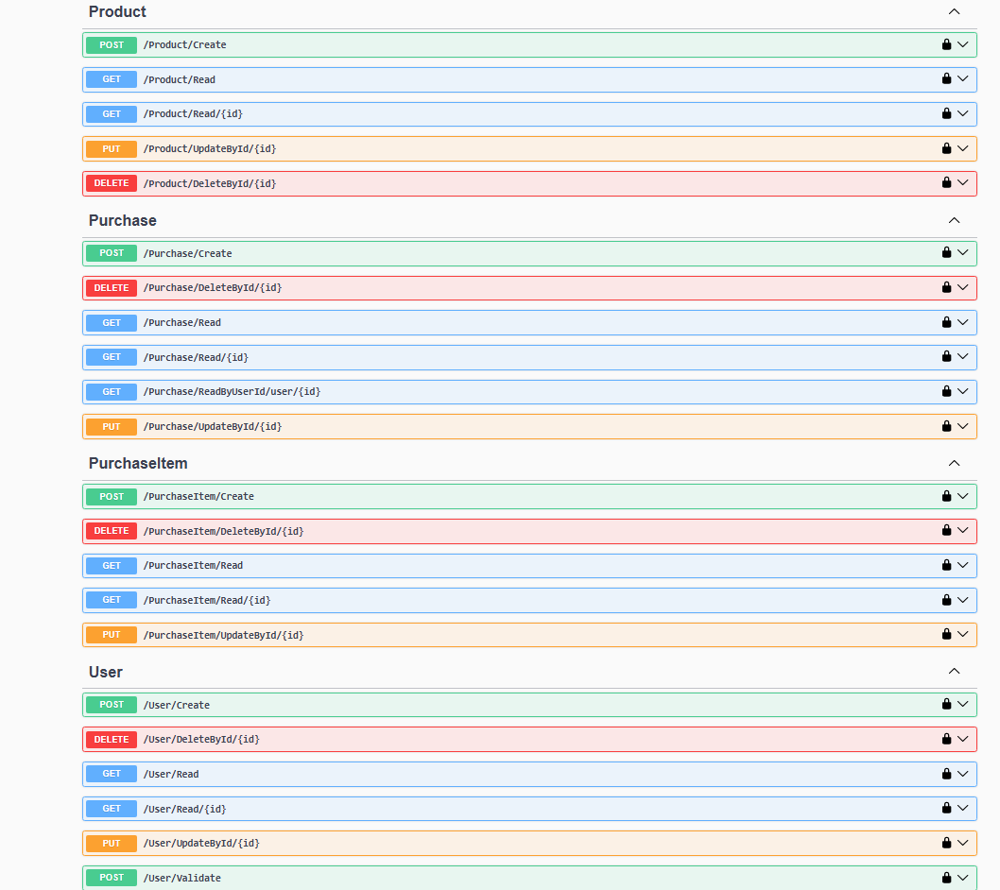
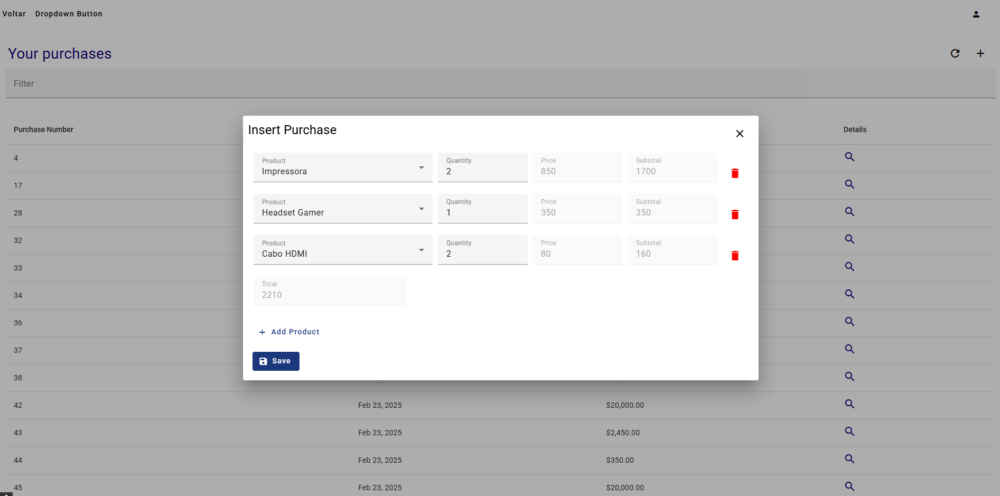
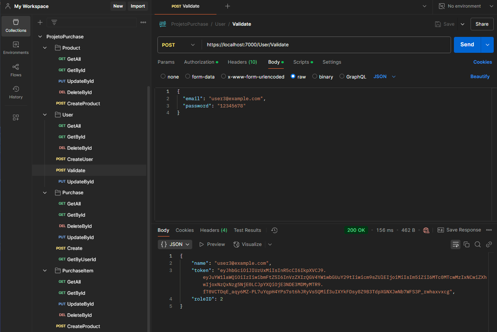
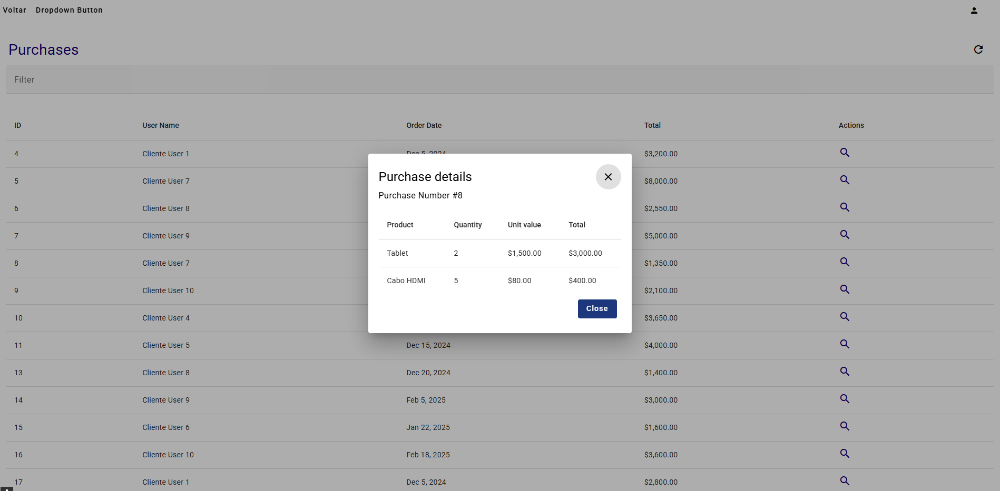

# The Alfa Laval Code Challenge Base

## Basic CRUD
This software follows Basic Crud structure, designed to maintain consistency with similar applications but with their owns particularities.

### API
1. **`/Controllers`** - This layer defines all mapped endpoints, accessible via Swagger:
   - Local Debug: [https://localhost:7000/swagger/](https://localhost:7000/swagger/)
   - Server Side: `{applicationUrl}/api/swagger/`
2. **`/Core`** - Contains core functionalities such as **DB** operations, **Encryption**, **HTTP Services**, and **Global Constants**.
3. **`/Models`** - Data Transfer Objects (DTOs) for each database table.
4. **`/Repositories`** - Handles database communication and operations.
5. **`/Services`** - Provides additional logic where endpoints may access multiple repositories or perform specific actions, returning unified results.

### Database
- **`CodeChallenge.sqlite`** - A small database created for this challenge.
- **`create.sql`** - Script for creating the complete database structure required for the application.
- **`insert&Update.sql`** - Script for insert and update some random lines in the database.

## Database Modeling



### Frontend
1. **`/src/app/components`** - Holds all individual components.
2. **`/src/app/core`** - Core functionalities, including **Models**, **Services**, and **Global Constants**.
3. **`/src/app/dialogs`** - Collection of all dialog components.
4. **`/src/app/shared`** - Contains all shared pages. 

# Screens Example
 
  
 
 
   
 


# How to deploy this project

## On Local Machine:

### Required software:
- [Git](https://git-scm.com/download/win)
- [.NET Core 8.0 SDK](https://dotnet.microsoft.com/pt-br/download/dotnet/8.0)
- [NVM](https://github.com/coreybutler/nvm-windows/releases/tag/1.1.12)

### Getting source code:
- Clone this repository
- Open cmd and execute this code changing the CHANGE-ME to the software Git URL:
```
https://github.com/delmiraugusto/SistemaGerenciamentoCompras.git
```
### Building:

- Run the build.bat
